# 面向领域设计文档

## 1. 项目背景

网上购物系统是现代化的购物系统，提供足不出户便能够买到心仪商品的服务系统。无论是开设个人网上购物商店还是企业在线购物商城，一套好用的网上购物系统都是必须的。网上购物系统拥有完整规范的商流和金流，整合了几十家国内知名的支付网关，并且内置了多套精美模版，同时还提供灵活强大的模版编辑功能。商家可以根据自己的喜好对网上商店的前台页面做个性化设置。

## 2. 项目用例

### 用例图

商家用例

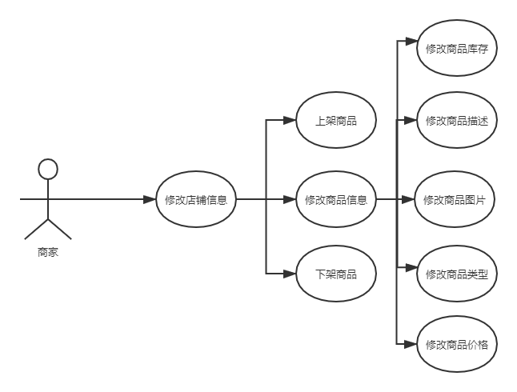

用户用例

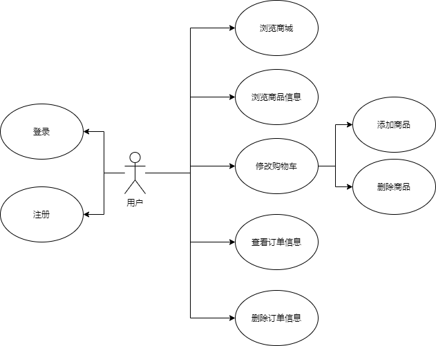

### 核心业务流程图

+ 用户购买流程

  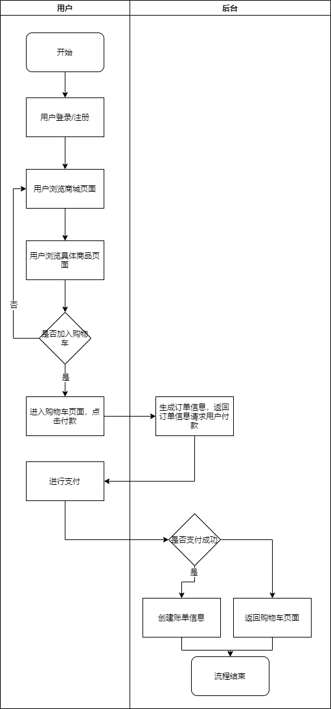

## 3. 功能点描述

### 产品功能框架

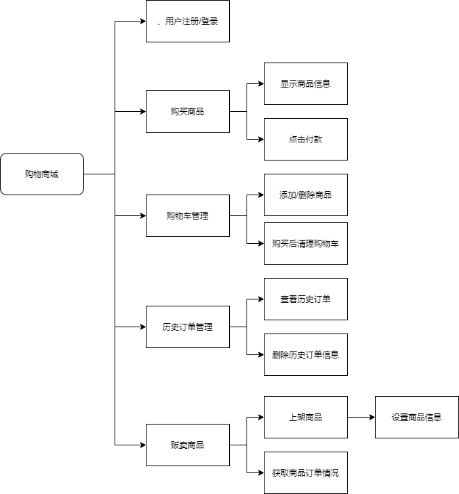

### 项目结构

项目整体结构如图

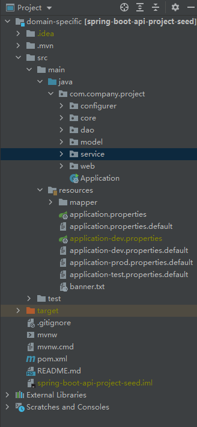

其相互依赖的关系如图

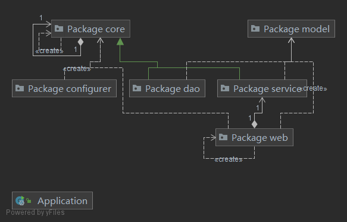

+ configurer中包含各类配置文件
+ core中包含项目导入的一些通用接口及方法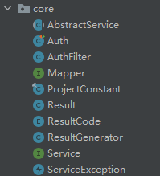
+ dao中包含通用Mapper根据我们设计的数据库所生成的数据库交互基本Mapper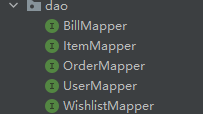
+ model中包含根据表结构生成的数据类的定义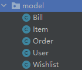
+ service包含继承于Service和AbstractService的使用具体数据类型的接口
+ web包含与前端交互的操作的各类方法类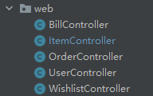
+ Application是后台启动的入口

### Mapper结构

因为dao中的不同Mapper之间的差距只有输入参数的数据类型，这里以ItemMapper为例

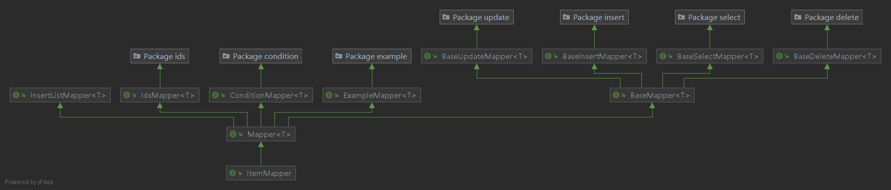

ItemMapper继承于导入的通用Mapper，通用Mapper继承于各类更基本的Mapper类型，如根据Condition查询的ConditionMapper，根据Id查询的IdsMapper等

### Model结构

model的结构与数据库表结构高度关联，这里就以ItemModel的结构为例

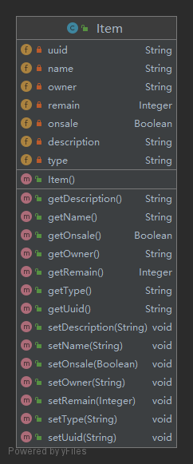

### 前后端交互接口

通用Mapper方法

| 方法名 | 参数       | 功能                   | 前端调用方法 | 前端调用URL | 返回值        |
| ------ | ---------- | ---------------------- | ------------ | ----------- | ------------- |
| add    | 对应实体   | 向数据库中添加条目     | POST         | /add        | success/fail  |
| delete | 条目主键id | 删除数据库中指定条目   | POST         | /delete     | success/fail  |
| update | 对应实体   | 更新数据库对应条目     | POST         | /update     | success/fail  |
| detail | 条目主键id | 查询id对应条目所有信息 | POST         | /detail     | 条目信息/fail |

ItemController方法

| 方法名          | 参数                   | 功能                             | 前端调用方法 | 前端调用URL      | 返回值              |
| --------------- | ---------------------- | -------------------------------- | ------------ | ---------------- | ------------------- |
| addItem         | 包含Item属性的Map      | 向Item表添加一个Item             | POST         | /addItem         | success/failed      |
| updateItem      | 包含Item属性的Map      | 修改Item表中对应的Item字段       | POST         | /updateItem      | success/failed      |
| listOwnerItem   | owner的名字，分页信息  | 获取owner拥有的所有Item          | GET          | /listByOwner     | 分页条目信息/failed |
| listAllItem     | 分页信息               | 获取所有上架的Item               | GET          | /listAll         | 分页条目信息/failed |
| listItemByType  | Item类型，分页信息     | 按Item类型获取所有上架的Item     | GET          | /listItemByType  | 分页条目信息/failed |
| listItemByPrice | Item价格区间，分页信息 | 按Item价格区间获取所有上架的Item | GET          | /listItemByPrice | 分页条目信息/failed |
| listItemByName  | Item名字，分页信息     | 按Item的名字获取所有上架的Item   | GET          | /listItemByName  | 分页条目信息/failed |

BillController方法

| 方法名     | 参数   | 功能     | 前端调用方法 | 前端调用URL | 返回值 |
| ---------- | ------ | -------- | ------------ | ----------- | ------ |
| createBill | 订单号 | 创建账单 | POST         | /createBill | 账单号 |

OrderListController方法

| 方法名          | 参数           | 功能                    | 前端调用方法 | 前端调用URL      | 返回值              |
| --------------- | -------------- | ----------------------- | ------------ | ---------------- | ------------------- |
| createOrder     | 订单物品信息   | 创建订单                | POST         | /createOrder     | 订单号+总价/failed  |
| listOrderByUser | 分页信息       | 获取当前用户的所有Order | GET          | /listOrderByUser | 分页条目信息/failed |
| setBill         | 订单号，账单号 | 设置订单对应的账单号    | POST         | /setBill         | success/failed      |
| setFinish       | 订单号         | 将对应订单设置为完成    | POST         | /setFinish       | success/failed      |

UserController方法

| 方法名       | 参数                     | 功能                                                         | 前端调用方法 | 前端调用URL        | 返回值       |
| ------------ | ------------------------ | ------------------------------------------------------------ | ------------ | ------------------ | ------------ |
| register     | email,username,passwd    | 用于注册账号，在数据库中加入相应的数据                       | POST         | /user/register     | fail/success |
| login        | email,passwd             | 用于账号的登录，进行登录信息的验证，如果登录成功，则会对登录状态和信息进行相应的记录(同时在登录前会判断是否已经登录) | POST         | /user/login        | fail/success |
| changePasswd | passwd,newpasswd         | 用于修改密码，使用该功能需要判断用户是否已经登录，只有登录才能使用 | POST         | /user/changePasswd | fail/success |
| forgetPasswd | email,username,newpasswd | 用于忘记密码时找回密码，不需要进行登录操作                   | POST         | /user/forgetPasswd | fail/success |
| logout       | 无                       | 用于登出操作，需要在session中和redis中去除相应的记录信息     | POST         | /user/logout       | fail/success |
| uploadAvatar | (MultipartFile) file     | 用于上传头像，在服务器进行保存和数据库中进行记录             | POST         | /user/uploadAvatar | fail/success |
| getAvatar    | 无                       | 用于加载头像                                                 | POST         | /user/getAvatar    | fail/success |

WishlistController方法

| 方法名         | 参数            | 功能                             | 前端调用方法 | 前端调用URL              | 返回值                          |
| -------------- | --------------- | -------------------------------- | ------------ | ------------------------ | ------------------------------- |
| addWishlist    | itemUUID,number | 用于即时修改购物车某种货品的数量 | POST         | /wishlist/addWishlist    | successfully insert/failed      |
| removeWishlist | wishlist        | 当购买或者删除一定的购物车商品时 | POST         | /wishlist/removeWishlist | "成功删除"/"没有能从购物车移除" |
| listItem       | 无              | 页面需要获取相应的购物车信息     | POST         | /wishlist/listItem       | 分页条目信息/failed             |

### 后端调用接口

| 方法名         | 参数                   | 功能                           |
| -------------- | ---------------------- | ------------------------------ |
| reduceItem     | uuid,number            | 从数据库中减少物品的库存数量   |
| createOrder    | orderList              | 创建订单信息                   |
| removeWishList | wishList，findWishList | 从当前购物车中删除已购买的物品 |

## 4.容灾处理

容灾处理一般是用于处理数据库可能存在的出现的问题导致数据丢失的情况。一般的处理是将数据库进行备份。我们在项目中采用的是数据库的热备份，即MySQL自带的主从复制。而主从复制往往是结合读写分离进行的，所以我们在主从复制的基础上建立的读写分离。

### 4.1主从复制：

#### 4.1.1底层原理：

在主库中开启binlog，用于记录相应的操作，并发送相应操作给从库，从库也存在相应的线程用于处理读取数据，从而实现数据的复制

#### 4.1.2具体实现：

我们创建了三个MySQL服务，将其中一个作为主库，另两个作为从库（这样也可以实现简单的读操作的负载均衡）。在主库中配置开启binlog,并创建一个用户从库进行复制，赋予replication（复制）权限。并在从库设置master库

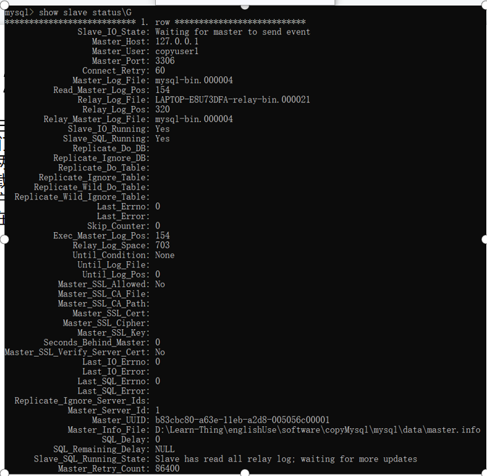

## 4.2读写分离

步骤1：动态数据库的切换

首先我们使用了AbstractRoutingDataSource类，其中存在一个Map，key为数据库的标识，value也就是实际的DateSource。
我们创建了一个enum用于存储三个数据库的标识，并创建一个工具类，并在其中使用ThreadLocal实现各个线程标识的安全转换。并且重写相应的获取数据源方法（基于后面会提到的ThreadLocal）

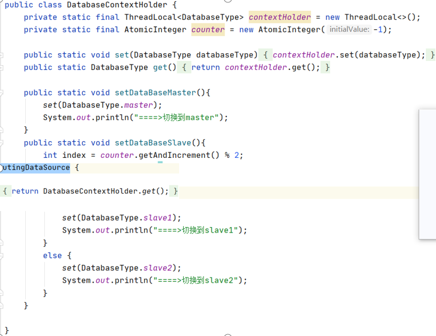

步骤2：利用AOP注解在DAO层前切换标识
创建两个注解，分别用于标识切换主数据库和从数据库。之后利用基于其注解上建立Aspect,利用@before设置执行数据库标识的切换，从而能够实现数据源的切换，之后将相应的注解放在DAO层方法

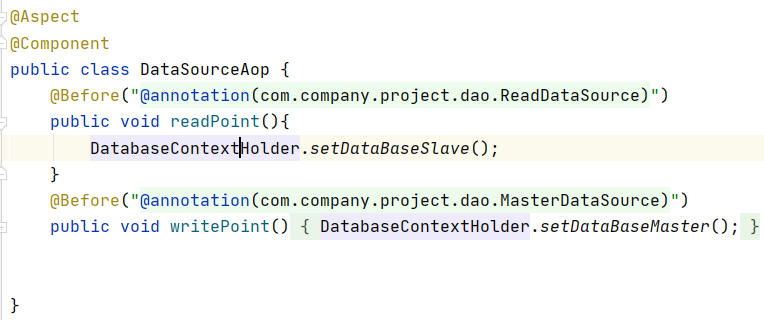

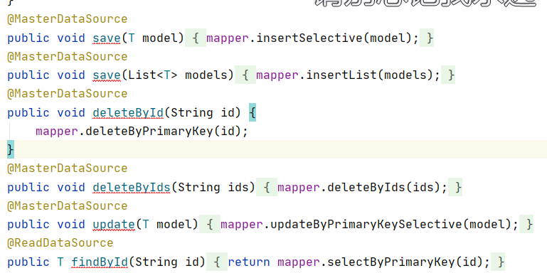

步骤3：简单的负载均衡

由于存在两个从库，我们可以实现简单负载均衡（前后两次不同，用原子的Integer来是实现），来使读操作作用于两个从库

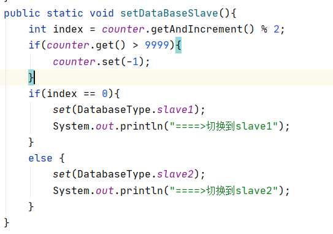