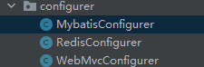

# 面向领域设计文档

## 1. 项目背景

该项目是为了产出一个类淘宝的电商交易平台

## 2. 项目用例

### 用例图

商家用例

用户用例

### 核心业务流程图

+ 用户购买流程

  

## 3. 功能点描述

### 产品功能框架

### 项目结构

项目整体结构如图

其相互依赖的关系如图

+ configurer中包含各类配置文件
+ core中包含项目导入的一些通用接口及方法
+ dao中包含通用Mapper根据我们设计的数据库所生成的数据库交互基本Mapper
+ model中包含根据表结构生成的数据类的定义
+ service包含继承于Service和AbstractService的使用具体数据类型的接口
+ web包含与前端交互的操作的各类方法类
+ Application是后台启动的入口

### Mapper结构

因为dao中的不同Mapper之间的差距只有输入参数的数据类型，这里以ItemMapper为例

ItemMapper继承于导入的通用Mapper，通用Mapper继承于各类更基本的Mapper类型，如根据Condition查询的ConditionMapper，根据Id查询的IdsMapper等

### Model结构

model的结构与数据库表结构高度关联，这里就以ItemModel的结构为例

### 前后端交互接口

通用Mapper方法

| 方法名 | 参数       | 功能                   | 前端调用方法 | 前端调用URL | 返回值        |
| ------ | ---------- | ---------------------- | ------------ | ----------- | ------------- |
| add    | 对应实体   | 向数据库中添加条目     | POST         | /add        | success/fail  |
| delete | 条目主键id | 删除数据库中指定条目   | POST         | /delete     | success/fail  |
| update | 对应实体   | 更新数据库对应条目     | POST         | /update     | success/fail  |
| detail | 条目主键id | 查询id对应条目所有信息 | POST         | /detail     | 条目信息/fail |

ItemController方法

| 方法名          | 参数                   | 功能                             | 前端调用方法 | 前端调用URL      | 返回值              |
| --------------- | ---------------------- | -------------------------------- | ------------ | ---------------- | ------------------- |
| addItem         | 包含Item属性的Map      | 向Item表添加一个Item             | POST         | /addItem         | success/failed      |
| updateItem      | 包含Item属性的Map      | 修改Item表中对应的Item字段       | POST         | /updateItem      | success/failed      |
| listOwnerItem   | owner的名字，分页信息  | 获取owner拥有的所有Item          | GET          | /listByOwner     | 分页条目信息/failed |
| listAllItem     | 分页信息               | 获取所有上架的Item               | GET          | /listAll         | 分页条目信息/failed |
| listItemByType  | Item类型，分页信息     | 按Item类型获取所有上架的Item     | GET          | /listItemByType  | 分页条目信息/failed |
| listItemByPrice | Item价格区间，分页信息 | 按Item价格区间获取所有上架的Item | GET          | /listItemByPrice | 分页条目信息/failed |
| listItemByName  | Item名字，分页信息     | 按Item的名字获取所有上架的Item   | GET          | /listItemByName  | 分页条目信息/failed |

BillController方法

| 方法名     | 参数   | 功能     | 前端调用方法 | 前端调用URL | 返回值 |
| ---------- | ------ | -------- | ------------ | ----------- | ------ |
| createBill | 订单号 | 创建账单 | POST         | /createBill | 账单号 |

OrderListController方法

| 方法名          | 参数           | 功能                    | 前端调用方法 | 前端调用URL      | 返回值              |
| --------------- | -------------- | ----------------------- | ------------ | ---------------- | ------------------- |
| createOrder     | 订单物品信息   | 创建订单                | POST         | /createOrder     | 订单号+总价/failed  |
| listOrderByUser | 分页信息       | 获取当前用户的所有Order | GET          | /listOrderByUser | 分页条目信息/failed |
| setBill         | 订单号，账单号 | 设置订单对应的账单号    | POST         | /setBill         | success/failed      |
| setFinish       | 订单号         | 将对应订单设置为完成    | POST         | /setFinish       | success/failed      |

UserController方法

| 方法名       | 参数                     | 功能                                                         | 前端调用方法 | 前端调用URL        | 返回值       |
| ------------ | ------------------------ | ------------------------------------------------------------ | ------------ | ------------------ | ------------ |
| register     | email,username,passwd    | 用于注册账号，在数据库中加入相应的数据                       | POST         | /user/register     | fail/success |
| login        | email,passwd             | 用于账号的登录，进行登录信息的验证，如果登录成功，则会对登录状态和信息进行相应的记录(同时在登录前会判断是否已经登录) | POST         | /user/login        | fail/success |
| changePasswd | passwd,newpasswd         | 用于修改密码，使用该功能需要判断用户是否已经登录，只有登录才能使用 | POST         | /user/changePasswd | fail/success |
| forgetPasswd | email,username,newpasswd | 用于忘记密码时找回密码，不需要进行登录操作                   | POST         | /user/forgetPasswd | fail/success |
| logout       | 无                       | 用于登出操作，需要在session中和redis中去除相应的记录信息     | POST         | /user/logout       | fail/success |
| uploadAvatar | (MultipartFile) file     | 用于上传头像，在服务器进行保存和数据库中进行记录             | POST         | /user/uploadAvatar | fail/success |
| getAvatar    | 无                       | 用于加载头像                                                 | POST         | /user/getAvatar    | fail/success |

WishlistController方法

| 方法名         | 参数            | 功能                             | 前端调用方法 | 前端调用URL              | 返回值                          |
| -------------- | --------------- | -------------------------------- | ------------ | ------------------------ | ------------------------------- |
| addWishlist    | itemUUID,number | 用于即时修改购物车某种货品的数量 | POST         | /wishlist/addWishlist    | successfully insert/failed      |
| removeWishlist | wishlist        | 当购买或者删除一定的购物车商品时 | POST         | /wishlist/removeWishlist | "成功删除"/"没有能从购物车移除" |
| listItem       | 无              | 页面需要获取相应的购物车信息     | POST         | /wishlist/listItem       | 分页条目信息/failed             |

